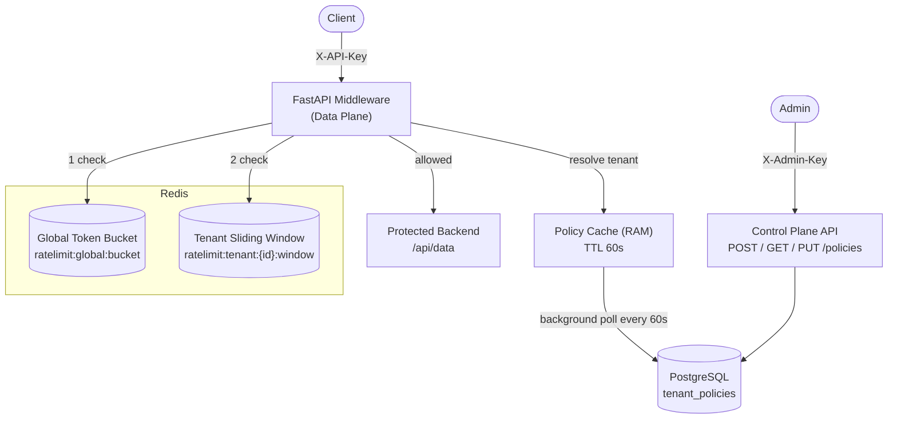
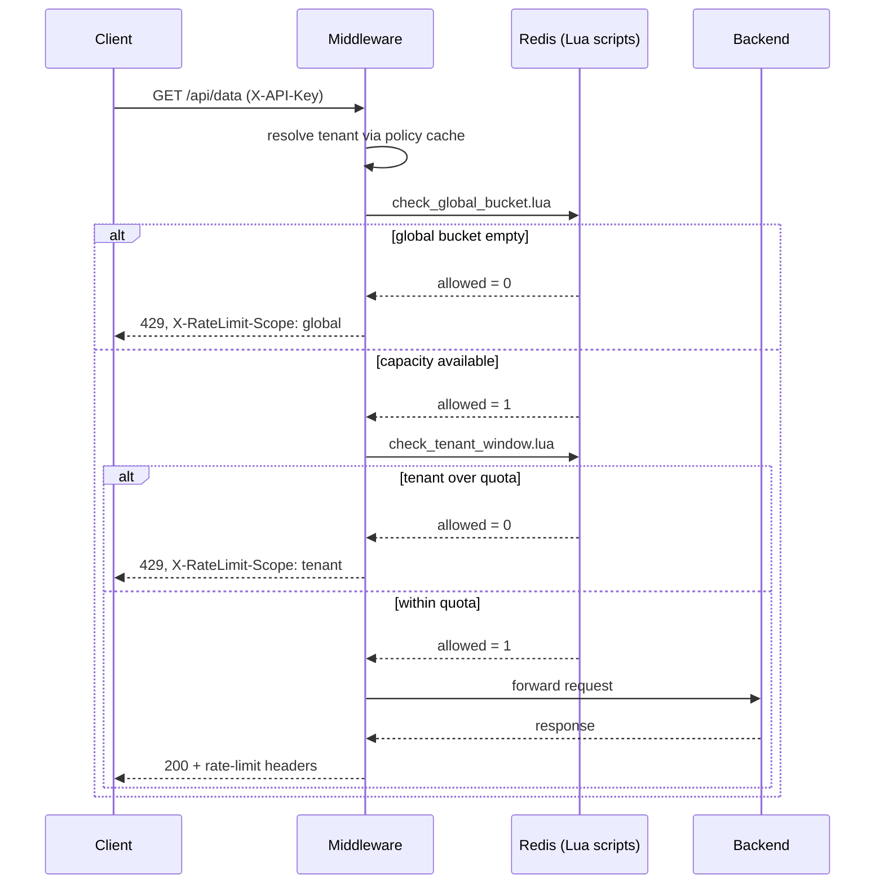
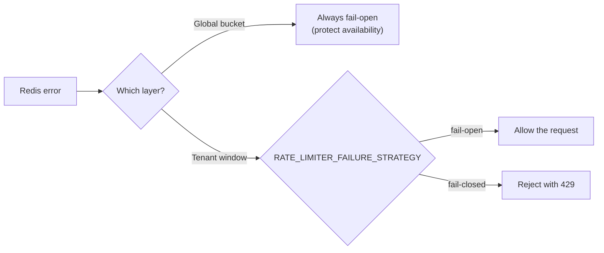

# Distributed Rate Limiter


A hybrid distributed rate limiter that combines a **global token bucket** with
**per-tenant sliding-window counters**, enforced atomically through Redis/Lua so
correctness holds even with multiple gateway instances hammering it concurrently.

> Built to answer two questions at once: *"how do I stop a traffic spike from
> taking down my backend?"* and *"how do I stop one noisy tenant from starving
> everyone else?"* — with a single request path, not two bolted-together systems.

## Table of Contents

- [Why a Hybrid Design](#why-a-hybrid-design)
- [Architecture](#architecture)
- [Request Flow](#request-flow)
- [Design Decisions](#design-decisions)
- [Redis Key Schema](#redis-key-schema)
- [Atomicity Guarantee](#atomicity-guarantee)
- [Failure Strategy](#failure-strategy)
- [Tech Stack](#tech-stack)
- [API Reference](#api-reference)
- [Getting Started](#getting-started)
- [Load Testing and Results](#load-testing-and-results)
- [Non-Goals](#non-goals)
- [Roadmap](#roadmap)

## Why a Hybrid Design

| Approach | Protects | Fails at |
|---|---|---|
| Global limiter only | Backend infrastructure from aggregate spikes | One tenant can still starve every other tenant |
| Per-tenant limiter only | Fairness between tenants | Does nothing when *everyone's* combined traffic overwhelms the backend |
| **Both, evaluated in order** | Infrastructure *and* fairness | — |

The two layers are checked in a fixed, cheap-first order: the global bucket is a
single Redis key, so it's checked first and rejects infrastructure-threatening
bursts before a second round-trip is spent on per-tenant fairness. If the global
bucket rejects a request, the per-tenant counter is **never touched** — a tenant
should never be charged quota for a request that was never going to be served.

## Architecture



The gateway is stateless — all rate-limit state lives in Redis, and policy state
lives in Postgres with a 60-second in-memory cache in front of it, so policy
changes propagate to every running gateway instance without a restart.

## Request Flow



## Design Decisions

| Decision | Choice | Rationale |
|---|---|---|
| Burst control algorithm | Token bucket (global) | Absorbs short bursts while capping sustained throughput to protect backend infra |
| Fairness algorithm | Sliding window counter (per-tenant) | Memory-efficient at scale (many tenants), smooths boundary bursts better than a fixed window |
| Atomicity | Server-side Lua scripts in Redis | Redis executes Lua atomically — no read-modify-write race across gateway instances |
| Clock source | Server-provided timestamp per request | All Lua math derives from a single passed-in `now`, keeping the refill/window math self-consistent per call |
| Failure strategy | Runtime-configurable via `RATE_LIMITER_FAILURE_STRATEGY` | Different endpoints need different availability/consistency tradeoffs |
| Evaluation order | Global bucket first, then per-tenant window | Cheap fail-fast against infra-threatening bursts before spending a second Redis round-trip on fairness |

## Redis Key Schema

| Purpose | Key pattern | Type | Notes |
|---|---|---|---|
| Global token bucket | `ratelimit:global:bucket` | Hash `{tokens, last_refill_ts}` | Single key; refill computed lazily on each check |
| Per-tenant sliding window | `ratelimit:tenant:{tenant_id}:window` | Sorted set (ZSET) of request IDs scored by timestamp | TTL = window size, auto-expires idle tenants |

## Atomicity Guarantee

Both Lua scripts do their entire read → compute → write in one Redis-side
execution:

- **`check_global_bucket.lua`** — reads `tokens`/`last_refill_ts`, computes the
  refill for elapsed time, caps at capacity, and deducts a token — all in one
  atomic call.
- **`check_tenant_window.lua`** — prunes expired entries out of the ZSET, counts
  what's left, and (if under quota) inserts the new request — all in one atomic
  call.

Because Redis runs each script as a single atomic unit, two gateway instances
calling the same script concurrently can never interleave a read from one with
a write from the other — eliminating the classic distributed rate-limiter bug of
double-counting (or under-counting) requests under load.

## Failure Strategy

Redis being unreachable is handled deliberately, not accidentally — the two
layers are allowed to behave differently on purpose:



The global bucket always fails open — infrastructure shouldn't fall over just
because Redis hiccuped. The per-tenant layer respects whatever strategy the
deployment configures, since one tenant's fairness violation is not a
system-wide availability emergency.

## Tech Stack

| Layer | Choice |
|---|---|
| Language | Python 3.11+ |
| API framework | FastAPI |
| Hot-path store | Redis (atomic Lua scripts) |
| Durable store | PostgreSQL (tenant policies) |
| Load testing | Locust |
| Dashboard | Streamlit + Plotly |
| Containerization | Docker + Docker Compose |

## API Reference

**Data plane** — requires `X-API-Key` identifying the tenant:

| Method | Path | Description |
|---|---|---|
| `GET` | `/api/data` | Example protected endpoint sitting behind the rate limiter |

**Control plane** — requires `X-Admin-Key`:

| Method | Path | Description |
|---|---|---|
| `POST` | `/policies/` | Create a tenant policy (`tenant_id`, `limit`, `window_seconds`, `burst_allowance`) |
| `GET` | `/policies/{tenant_id}` | Read a tenant's policy |
| `PUT` | `/policies/{tenant_id}` | Update an existing tenant's policy |

Every response carries `X-RateLimit-Limit`, `X-RateLimit-Remaining`, and
`X-RateLimit-Reset`. A rejected request additionally carries
`X-RateLimit-Scope` (`global` or `tenant`) and `Retry-After`, with body:

```json
{"error": "rate_limit_exceeded", "scope": "tenant", "retry_after_seconds": 42}
```

## Getting Started

```bash
cp .env.example .env
docker-compose up -d
```

This brings up the API (port `8000`), Redis, and Postgres. Then seed a couple of
example tenant policies and run the load test:

```bash
make setup   # creates the good_tenant / spiky_tenant policies used by locustfile.py
make test    # runs Locust against localhost:8000
```

Or view results in the dashboard after a run:

```bash
make dashboard
```

## Load Testing and Results

`locustfile.py` runs two competing tenant profiles against the live stack:

- **GoodCitizen** — steady, moderate traffic that should *never* be rate-limited.
- **SpikyUser** — bursts of concurrent requests designed to exceed its own
  per-tenant quota, proving the tenant layer rejects **independently** of the
  global bucket's remaining capacity.

A recorded run against `/api/data` — **1,438 requests, 0 failures**:

```
P50    █                2 ms
P75    ██               4 ms
P90    ███              6 ms
P95    █████            9 ms
P99    █████████       18 ms
P99.9  ███████████████ 30 ms
```

| Metric | Target | Measured |
|---|---|---|
| P99 latency added by rate-limit check | < 30 ms | **18 ms** ✅ |
| Error rate under load | < 1% | **0%** ✅ |
| Redis round-trips per request (happy path) | ≤ 2 | **2** (one Lua call per layer) ✅ |

## Non-Goals

This is a rate-limiting service sitting in front of an API, not a general-purpose
gateway — no request routing or reverse-proxying to arbitrary backends (that's
Kong/Envoy territory). Redis runs single-node: Sentinel/Cluster HA and
multi-region rate-limit synchronization are explicitly out of scope for this
version.

## Roadmap

- [ ] Concurrency test proving zero over-limit admissions under simultaneous requests
- [ ] GitHub Actions CI gate that runs the Locust suite and fails the build on P99/error-rate regressions
- [ ] Chaos test: kill Redis mid-load-test and verify the configured failure strategy actually triggers
- [ ] Per-endpoint (not just per-tenant-global) quotas
